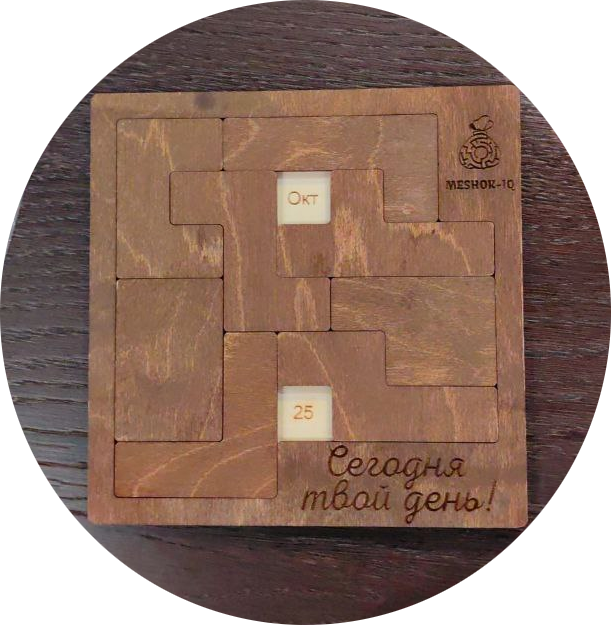

## Головоломка Джона

Решение паззла. Размещение хитровывернутых двумерных фигур по полю.

### Предистория

Написал мне как-то друг в телеграм.  Даже не столько написал, сколько скинул две фотографии головоломки, которую ему подарили на день рождения.

Намекая, что хорошо бы такую задачу решить не перекладывая фигурки на доске, а компом. 
Зная бросающего вызов, можно было предположить, что его решение существует, готово, и весьма близко к идеальному.
Что, он, кстати, при встрече и продемонстрировал - у него перебор всех дат за считанные секунды проходит.

Ну и пришлось поучаствовать. Скажу честно, первый вариант был "штурмом в лоб" и действовал практически вечность. Там время измерялась минутами, даже без рисования.
Так что пришлось вернуться к задаче и сделать по-человечески.

В итоге я, как видите, даже не поленился привести в приличный вид, и выложить. За алгоритм, в общем, не стыдно. 

Хотя можно и дальше оптимизировать (у некоторых выпуклых вправо симметрий фигур есть лишние проверки, например), но существенной роли это не уже сыграет. 
